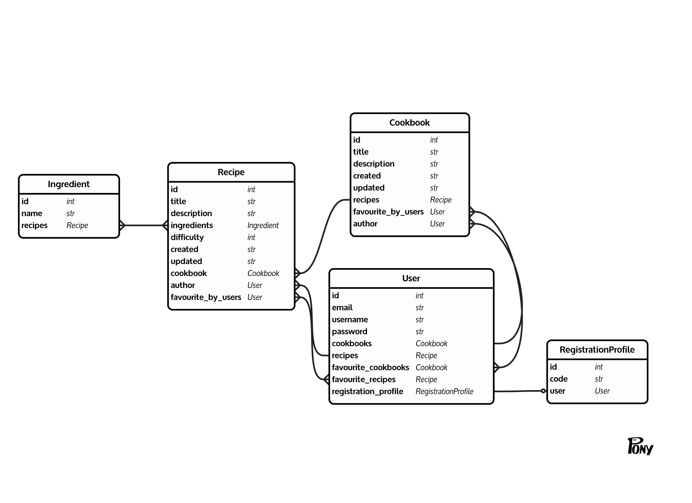

# Recipe and Cookbook Management API


This is a Recipe and Cookbook Management API project built with Django and Django Rest
Framework.
It allows you to manage recipes, cookbooks, and users in a convenient and efficient
manner.

## Features

- **User Authentication**: Secure user registration, login, and token-based
  authentication.
- **Cookbook and Recipe Management**: Create, read, update, and delete recipes and
  cookbooks.
- **Favorite Recipes & Cookbooks**: Users can mark recipes and cookbooks as favorites.
- **Custom User Model**: Implement a custom user model for flexibility.
- **Admin Panel**: Manage recipes, cookbooks, and users conveniently through the admin
  panel.
- **Permissions**: Control access to modify or delete recipes and cookbooks.
- **Search Functionality**: Filter recipes and cookbooks by title or description.

## Getting Started

1. Clone the repository:

1. Create a virtual environment and activate it (optional but recommended):

1. Install the project dependencies:

   ```shell
   pip install -r requirements.txt
   ```

1. Run database migrations:

   ```shell
   python manage.py migrate
   ```

1. Create a superuser for the admin panel:

   ```shell
   python manage.py createsuperuser
   ```

1. Start the development server:

   ```shell
   python manage.py runserver
   ```

## Django Models:



## API Endpoints

Once the server is running, you can access the API at `http://localhost:8000/api/`.

### Authentication Endpoints

- `/api/auth/token/` (POST): Get JWT token.
- `/api/auth/token/refresh/` (POST): Refresh JWT token.
- `/api/auth/token/verify/` (POST): Verify JWT token.

### Cookbook Endpoints

- `/api/cookbooks/` (GET): Get all cookbooks
- `/api/cookbooks/{cookbook_id}/` (GET): Get single cookbook
- `/api/cookbooks/{cookbook_id}/` (PUT): Update single cookbook
- `/api/cookbooks/{cookbook_id}/` (DELETE): Delete single cookbook
- `/api/cookbooks/` (POST): Create single cookbook
- `/api/cookbooks/toggle-favourite/{cookbook_id}/` (POST): Toggle favorite cookbook - 
a logged-in user can mark or unmark a cookbook as a favorite.

### Recipe Endpoints

- `/api/recipes/` (GET): Get all recipes
- `/api/recipes/{recipe_id}/` (GET): Get single recipe
- `/api/recipes/{recipe_id}/` (PUT): Update single recipe
- `/api/recipes/{recipe_id}/` (DELETE): Delete single recipe
- `/api/recipes/` (POST): Create single recipe
- `/api/recipes/toggle-favourite/{recipe_id}/` (POST): Toggle favorite recipe - 
a logged-in user can mark or unmark a recipe as a favorite.

## Authentication

- Use the `/api/auth/token/` endpoint to obtain a JWT token for user authentication.
- Use the token in the Authorization header of subsequent requests to authenticate.

## Permissions

- By default, requests require an authenticated user.
- Viewing recipes and cookbooks is open to all users (no authentication required).
- Only the author of a recipe or cookbook or admin can update or delete it.

## Admin Panel

- Access the admin panel at `http://localhost:8000/admin/`.
- Use the panel to manage recipes, cookbooks, and users conveniently.
